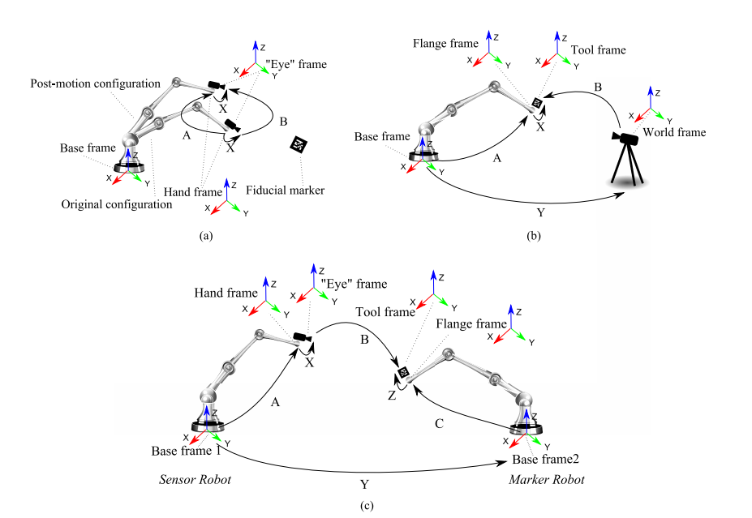

# Calibration
calibration is a method to calculate  the relationship between the sensor and the gripper. There are three formulations [1]:
 * **Hand–eye calibration**: Fig.1 (a)
 * **Robot–world and tool–flange calibration**: Fig.1 (b)
 * **robot–robot calibration**: Fig.1 (c)

 <p align="center"></p>
 <p align="center">Figure 1. (a) Hand–eye calibration that can be formulated as an <b>AX = XB</b> problem. (b) Robot–world and tool–flange calibration problem that can be formulated to an <b>AX = YB</b> matrix equation. (c) Hand–eye, tool–flange, and robot–robot calibration problem that can be formulated in a matrix equation as <b>AXB = YCZ</b>. [1]</p>

## Eye On Base 2D Implementation
### Configuration Template
```yaml
# robot base coordinate, unit meter
# [x, y]
xy1: [-0.27495, -0.44082]
xy2: [-0.28243, -0.66396]
xy3: [-0.00210, -0.67530]
xy4: [-0.00233, -0.46438]
# camera base coordinate
# [col, row]
uv1: [465, 235]
uv2: [450, 362]
uv3: [624, 374]
uv4: [626, 253]

```
### Loaction
deepclaw/modules/calibration/Calibration2D.py
### Description
Transfer the image coordinate to robot coordinate with affine transformation.
### Uasge
在抓取平面放置四个标记物，拍摄一张照片，记录（手动/自动）其在照片坐标系下的坐标（u，v），
然后保证机械臂末端竖直（rpy为pi，0,0）,控制机械臂的tcp中心对应走四个标记点，记录其在机械臂坐标系的坐标（x，y）。
创建标定配置文件，输入两套坐标系下的坐标。然后进行标定
```
    from deepclaw/modules/calibration/Calibration2D import Calibration2D
    hand_eye = Calibration2D(CALI2D_CFG_PATH)
    x, y = hand_eye.cvt(u, v)

```

## Eye On Base 3D Implementation
### Configuration Template
```yaml
initial_position: [-0.302, -0.777, 0.278, 1.1636, -1.2518, 1.2317]
x_stride: 0.05
y_stride: 0.05
z_stride: 0.05
E_T_F:
  - [1,0,0,0.06]
  - [0,1,0,0.00]
  - [0,0,1,0.03]
  - [0,0,0,1]
CALIBRATION_DIR: 'Your_CaliData_Path.npz'
```
### Loaction
deepclaw/modules/calibration/EyeOnBase.py
### Description
标定相机和机械臂的空间关系，输出为机械臂基坐标系到相机坐标系的变换矩阵。
### Uasge
在机械臂末端法兰安装标定板，标定板为L型，一侧贴有4×4棋盘格，详见×××。
标定配置文件中的initial_position为标定时机械臂的初始位姿，在此姿态下，
应当保证标定板在相机中可见。
标定配置文件中的x_stride, y_stride, z_stride为机械臂在xyz方向的进动量，单位米。
标定配置文件中的E_T_F为标定板上棋盘格中心点在机械臂法兰坐标系下的位姿，因为不考虑方向，所以旋转矩阵为单位阵。
标定配置文件中CALIBRATION_DIR为保存标定数据的路径。
标定开始时先设置配置文件，然后在程序中根据你要标定的相机sensor设置然后main_sensor为'color', 'depth', 或者'infrared'，运行程序记录标定数据。
这里需要注意在相机配置位置中设置align_image参数与main_sensor一致。
```
# collect calibration data
camera = CAMERA_DRIVER
robot = ROBOT_DRIVER
# calibrate
calib_ins = Calibration(robot, camera, CALI_CFG_PATH, main_sensor='color')
calib_ins.run()

```

载入上面保持的标定数据，计算标定矩阵并保存。
```
c_t_b = load_calibration_matrix(CALI_CFG_PATH)
np.save('E_T_B.npy', c_t_b)
print(c_t_b)
```
使用时载入E_T_B矩阵，左乘目标在相机坐标系下的位姿矩阵。
## References
[1] Wu L, Wang J, Qi L, et al. Simultaneous Hand–Eye, Tool–Flange, and Robot–Robot Calibration for Comanipulation by Solving the AXB= YCZ Problem[J]. IEEE TRansactions on robotics, 2016, 32(2): 413-428.